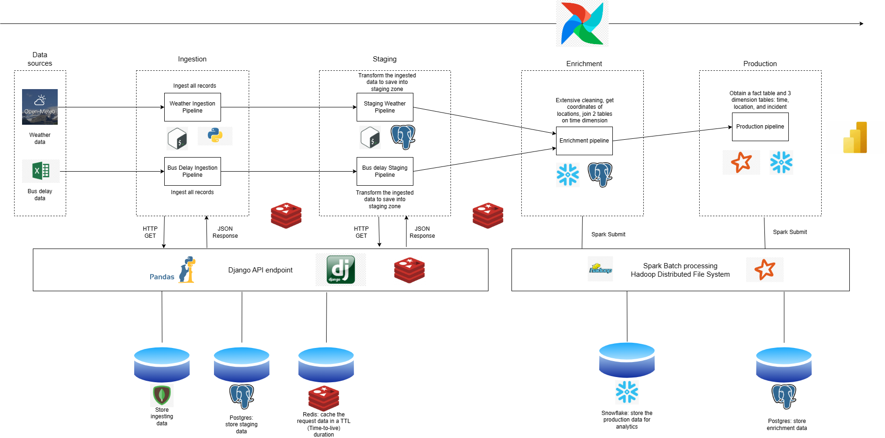

# Project Meteorif
## Table of Contents
- [Project Meteorif](#project-meteorif)
  - [Table of Contents](#table-of-contents)
- [Introduction](#introduction)
- [Architecture](#architecture)
  - [Airflow](#airflow)
  - [Pipeline API](#pipeline-api)
  - [Spark](#spark)
  - [Hadoop](#hadoop)
  - [Star Schema](#star-schema)
- [Pipelines](#pipelines)
  - [Ingestion](#ingestion)
    - [Bus delay data ingestion](#bus-delay-data-ingestion)
    - [Weather data ingestion](#weather-data-ingestion)
  - [Staging](#staging)
    - [Bus delay data staging](#bus-delay-data-staging)
    - [Weather data staging](#weather-data-staging)
  - [Enrichment](#enrichment)
  - [Production](#production)
- [Presentation](#presentation)
- [Future development](#future-development)
- [Project Submission Checklist](#project-submission-checklist)
- [How to run](#how-to-run)
- [Contact](#contact)
- [Acknowledgements](#acknowledgements)

# Introduction
This project is part of the Foundation of Data Engineering course in [INSA Lyon](https://www.insa-lyon.fr/en/). 
The goal of this project is to build multiple data pipelines to process weather data and bus delay time in Toronto data from 2017 to 2022 and make it available for analysis.

# Architecture
The architecture of this project is shown in the figure below. The data is ingested from two sources : the [Toronto Open Data](https://open.toronto.ca/) and [Open Meteo](https://open-meteo.com/en/docs). The data is then processed by the data pipeline and available for analysis.



## Airflow
The data pipeline is built using [Apache Airflow](https://airflow.apache.org/) and the [DAG](https://airflow.apache.org/docs/apache-airflow/stable/concepts.html#dags) concept in Airflow. The DAGs are defined in the `airflow/dags` folder.

## Pipeline API
Pipeline API is a Restful API that is built using [Django](https://www.djangoproject.com/) and [Django Rest Framework](https://www.django-rest-framework.org/). The API is used to trigger the data pipelines and to get the status of the data pipeline. The API is defined in the `pipeline_api` folder.
API Documentation can be found [here](https://github.com/5IF-Data-Engineering/pipeline-api/blob/main/README.md#api-documentation). We use [Django](https://www.djangoproject.com/) and [Django Rest Framework](https://www.django-rest-framework.org/) because we want to structure the code in another service
than Airflow. Django service is exposed on port 8000. We use this service for ingestion and staging area. In order to speed up the data pipeline, we use [Redis](https://redis.io/) to store the Json Response of the API call for a given TTL (time-to-live). 
We use [Redis](https://redis.io/) because it is an in-memory database, which is suitable for storing the Json Response of the API call.

## Spark
We use [Spark](https://spark.apache.org/) for the enrichment and production stage. We use [Spark](https://spark.apache.org/) because it is a distributed computing framework, which is suitable for processing large datasets. We use [Spark](https://spark.apache.org/) in the [Docker](https://www.docker.com/) container. The [Docker](https://www.docker.com/) image is defined in the `spark/Dockerfile`.
We want to speed up the write operation to [Snowflake](https://www.snowflake.com/), so we use [Spark](https://spark.apache.org/) to write the data into [Snowflake](https://www.snowflake.com/). [Spark](https://spark.apache.org/) supports parallel write operation.

## Hadoop
We use [Hadoop](https://hadoop.apache.org/) for the storage of the data. We use [Hadoop](https://hadoop.apache.org/) because it is a distributed file system, which is suitable for storing large datasets. We use [Hadoop](https://hadoop.apache.org/) in a [Docker](https://www.docker.com/) container.
The data is stored in the `hadoop/data` folder and then mounted to the [Docker](https://www.docker.com/) container.

## Star Schema
The data is stored in a Data Warehouse in [Snowflake](https://www.snowflake.com/), and is shown in the figure below.


# Pipelines
The data pipeline is divided into 4 stages: Ingestion, Staging, Enrichment, and Production.

## Ingestion
### Bus delay data ingestion
The bus delay time data is ingested from  6 Excel spreadsheets from [Toronto Open Data](https://open.toronto.ca/). We use [Pandas](https://pandas.pydata.org/) to read the Excel spreadsheets. When the data is ingested, 
the Json Response is also stored in the Redis database to avoid ingesting data in multiple times. And also, we use Redis inside the pipeline to save the output of `PythonOperator` and divide the data by year in order 
to speed up the data pipeline. Inside each pipeline, we use `xcomm` to communicate between the pipelines. In our case, we use `xcomm` to store the output of the operators.
The data pipeline is shown in the figure below.


DAG to run the pipeline:
- `ingestion_bus_delay_dag`

### Weather data ingestion
Each year, we divide the bus data into 4 parts: January to March, April to June, July to September, and October to December. Each part is then processed in parallel. Inside each task, we consider that small ETL pipelines are executed. The small ETL pipelines are triggered by
the API call, defined inside the `BashOperator` of the DAG. Each `BashOperator` will execute a Shell script to process the data. The Shell script is defined in the `./airflow/scripts` folder.
Inside each small ETL pipeline defined inside the `pipeline_api`, the data is extracted from [Open Meteo API](https://open-meteo.com/en/docs), then transformed using Pandas, and finally loaded into the MongoDB database. We choose the MongoDB database for the ingestion stage because it is a NoSQL database : it has many advantages as flexiblity and is schemaless, which is suitable for storing the raw data.

The weather data is ingested from the [Open Meteo API](https://open-meteo.com/en/docs). The data is ingested using the [Open Meteo API](https://open-meteo.com/en/docs) API. The data is then stored in the MongoDB database. The idea of the data pipeline is much similar to the bus delay time data ingestion. 
We divide the data by year. We then process the data in parallel. The weather data is also transformed using [Pandas](https://pandas.pydata.org/) and loaded into the MongoDB database. The data pipeline is shown in the figure below.


DAG to run the pipeline:
- `ingestion_weather_dag`

## Staging
### Bus delay data staging
We want to extract the data from the MongoDB database, transform it, and load it into the PostgreSQL database. We choose the PostgreSQL database for the staging stage because it is a relational database, which is suitable for storing the structured data. We use `PostgresOperator` and `BashOperator`. The data pipeline is shown in the figure below.


DAG to run the pipeline:
- `staging_bus_delay_dag`

### Weather data staging
First, we have to create a table for storing staging data. We extract the data from the MongoDB database. The transformed data is loaded into the PostgreSQL database.
And the ETL pipelines are triggered by API calling, defined inside the `pipeline_api` folder. We use partitioning by year for the staging database to speed up the data pipeline and to make it easier to join the data in the production environment. Here is the list of partitioned tables:


DAG to run the pipeline:
- `staging_weather_dag`

## Enrichment

We extract the bus delay data and the weather data from the PostgreSQL database, then join them together. And also, we use partitioning by year for the joined table.
We do some extensive cleanings and transformations using [Spark](https://spark.apache.org/). We use [Spark](https://spark.apache.org/) for the enrichment stage. SparkSubmit is used to submit the Spark job. 
The Spark job is defined in the `spark/app` folder. The Spark job is triggered by `SparkSubmitOperator`. In this stage, we want to get the 3 dimensions: location, time and incident.
We also want to add an identifier column for each dimension tables. These identifiers are foreign keys in the fact table. For location table, we use [Google Geocoding API](https://developers.google.com/maps/documentation/geocoding/overview)
to get the coordinates of over 60000 locations in Toronto. Here is an example of a `SparkSubmitOperator`:

```python
clean_incident = SparkSubmitOperator(
    task_id='clean_incident',
    application='/opt/bitnami/spark/app/enrichment/clean_incident.py',
    conn_id='spark_default',
    dag=dag,
    trigger_rule='none_failed',
    jars='/opt/bitnami/spark/jars/postgresql-42.2.23.jar',
    driver_class_path='/opt/bitnami/spark/jars/postgresql-42.2.23.jar',
    conf={'spark.master': 'spark://spark-master:7077'},
    verbose=True
)
```

The temporary Parquet files before loading into Data Warehouse are stored in the `hadoop/data` folder to be mounted to the [Docker](https://www.docker.com/) container. We have 4 DAGs for this stage, here is the order of the DAGs to be executed:
- `get_incident_dag`
- `get_loc_no_geo_dag`
- `get_location_dag`
- `get_time_dag`

## Production

We extract the data from the PostgreSQL staging database, then load it into the Data Warehouse on Snowflake. We make the star schema available on Snowflake for analysis on [PowerBI](https://powerbi.microsoft.com/en-us/).
We use also the `SnowflakeOperator` and `SparkSubmitOperator` to load the data into Snowflake. We have over 60000 locations, that why we have to divide into multiple operators of the location DAG.
After that, we merge the location data into one table. Here is the order of the DAGs to be executed:
- `get_fact_table_dag`
- `merge_location_dag`
- `save_dim_snowflake_dag`
- `save_fact_snowflake_dag`

Here is the data preview of the fact table:


# Presentation
- Presentation available [here](https://docs.google.com/presentation/d/1dOCUSrn3HKGtE6lQaHa4q8Igz6fDY4AQtRPbG2OfbhQ/edit?usp=sharing)

# Future development
- [ ] Add more data sources
- [ ] Add more data analysis
- [ ] Stream processing by Kafka

# Project Submission Checklist
- [x] Repository with the code, well documented
- [x] Docker-compose file to run the environment
- [x] Detailed description of the various steps
- [x] Report with the project design steps divided per area
- [x] Example dataset: the project testing should work offline, i.e., you need to have some sample data points.
- [x] Slides for the project presentation. You can do them too in markdown too.
- [x] Use airflow + pandas + mongodb + postgres
- [x] Using REDIS for speeding up steps
- [x] STAR schema design includes maintenance upon updates
- [x] Creativity: data viz, serious analysis, performance analysis, extensive cleansing.

# How to run
Clone the repository using the following command:
```bash
git clone https://github.com/5IF-Data-Engineering/deng-project.git
```
Update the submodules using the following command:
```bash
git submodule sync --recursive
git submodule update --init --recursive
```
Build or pull necessary Docker images using the following command:
```bash
docker pull nmngo248/spark:3.5.0
docker pull nmngo248/psat-airflow:latest
docker build -t nmngo248/pipeline-api:latest ./pipeline_api
```
Find the process id of the user using the following command:
```bash
id -u
```
Enter the process id of the user in the `.env` file.
```
AIRFLOW_UID=${id -u}
```
Initialize the Airflow database using the following command:
```bash
docker compose up airflow-init
```
If 0 is returned, it means that the Airflow database is initialized successfully. Otherwise, you have to remove the `tmp` folder and run the command again.

Add permission to execute for shell scripts
```bash
chmod +x ./airflow/scripts/*
```

After initializing the Airflow database, you can start the Airflow webserver and the scheduler using the following command:
```bash
docker compose up -d
```
After starting the Airflow webserver and the scheduler, you can access the Airflow webserver at `http://localhost:8080/`. \
You can access the Pipeline API at `http://localhost:8000/`.

Create the staging and production database in the PostgreSQL using the following command:
```bash
docker exec -it postgres psql -U postgres -c "CREATE DATABASE deng_staging;"
```

Add the following connections in the Airflow webserver:
- `postgres_staging`: PostgreSQL for staging connection
```bash
docker exec -it airflow-webserver airflow connections add postgres_staging --conn-uri postgresql://postgres:@postgres:5432/deng_staging
```
- `spark_default`: Spark connection

- `snowflake_default`: Snowflake connection
<p align="center">
  
  
</p>

After adding the connections, create the directories in the Hadoop using the following command:
```bash
docker exec -it namenode hdfs dfs -mkdir /output
docker exec -it namenode hdfs dfs -chmod 777 /output
```

If you want to verify the data in the Hadoop, you can use the following command:
```bash
docker exec -it namenode hdfs dfs -ls /output
```

If you want to see the Hadoop output files in the directory `hadoop/data`, you can use the following command:
```bash
docker exec -it namenode hdfs dfs -copyToLocal /output /hadoop-data
```

# Contact
- [Minh NGO](mailto:ngoc-minh.ngo@insa-lyon.fr)
- [Yazid SBAI](mailto:yazid.sbai@insa-lyon.fr)

# Acknowledgements
- [INSA Lyon](https://www.insa-lyon.fr/en/)
- [Open Meteo](https://open-meteo.com/en/docs)
- [Toronto Open Data](https://open.toronto.ca/)
- [GitHub Copilot](https://copilot.github.com/)
- [ChatGPT](https://chat.openai.com/)
- [Apache Airflow](https://airflow.apache.org/)
- [Spark](https://spark.apache.org/)
- [Hadoop](https://hadoop.apache.org/)
- [Google Geocoding API](https://developers.google.com/maps/documentation/geocoding/overview)
- [Django](https://www.djangoproject.com/)
- [Django Rest Framework](https://www.django-rest-framework.org/)
- [PostgreSQL](https://www.postgresql.org/)
- [Redis](https://redis.io/)
- [MongoDB](https://www.mongodb.com/)
- [Pandas](https://pandas.pydata.org/)
- [PowerBI](https://powerbi.microsoft.com/en-us/)
- [Snowflake](https://www.snowflake.com/)
